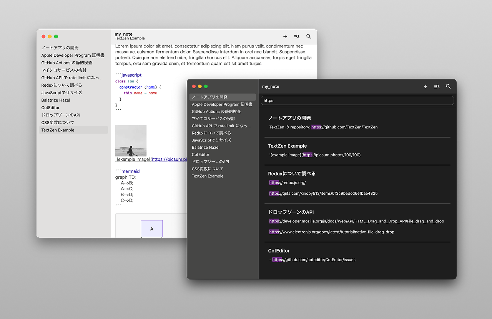
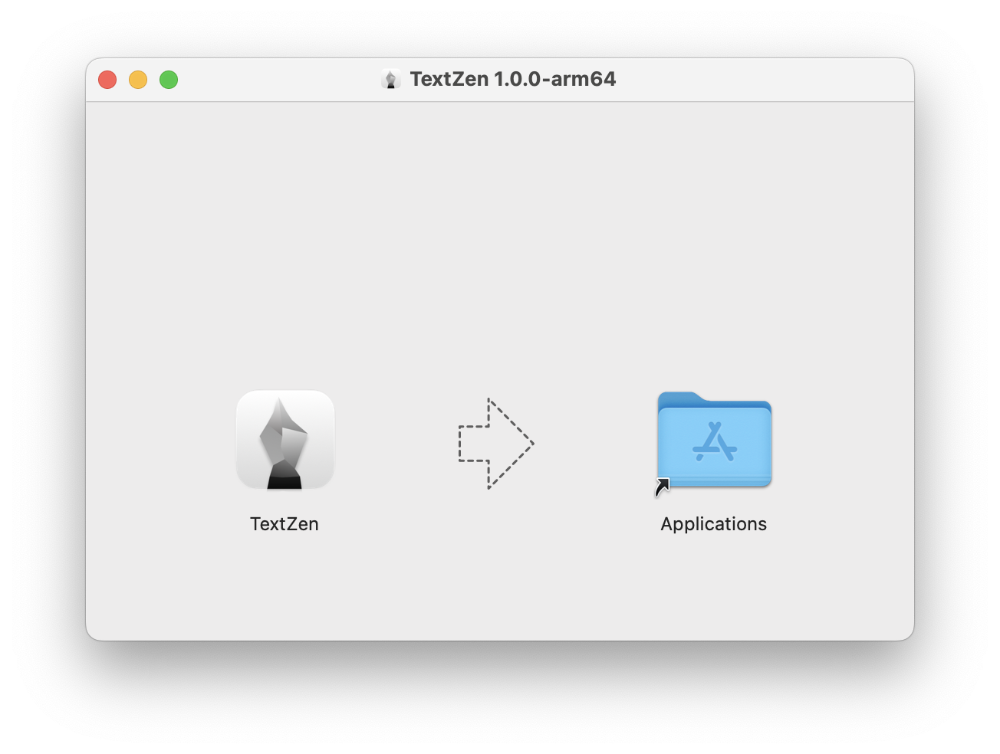
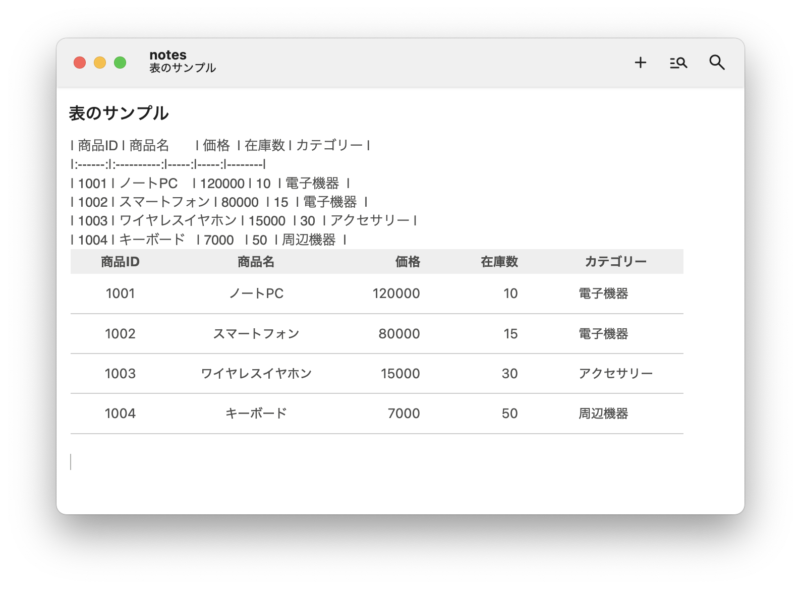

# TextZen

TextZen is a Markdown note-taking application for MacOS.



## TextZen Philosophy

- Always display Markdown syntax
- Organize notes with multiple files
- Open source is wonderful

## Installation

Get `.dmg` from the [latest release](https://github.com/TextZen/TextZen/releases), open it, and drag `TextZen` to Applications.



TextZen checks for updates automatically

## Basic Usage

### 1. Open a Folder

TextZen manages notes using multiple Markdown files under a specific folder, similar to Obsidian vaults.
After launching the app, press `⌘+O` to open a folder.

Note that TextZen does not support folder hierarchies.

### 2. Create Files

Press `⌘+N` to create a new file. In the title field, you can edit the title portion of the filename `<title>.md`.
We'll introduce how to use the editor later. Changes are automatically saved.

### 3. Search Files

Press `⌘+P` to search by filename. You can navigate search results using up/down cursor keys.

### 4. Full-text Search

Press `⌘+Shift+F` to perform full-text search across files in the folder.
Click on search results to jump to the corresponding location in the file.

### 5. View Backlinks

Press `⌘+Shift+B` to check references to the current file.

## Syntax

TextZen follows [GFM (GitHub Flavored Markdown)](https://docs.github.com/en/get-started/writing-on-github/getting-started-with-writing-and-formatting-on-github/basic-writing-and-formatting-syntax) standards.

### Mermaid.js

[Mermaid.js](https://mermaid.js.org/) is supported.

````markdown

````

### Internal Links

You can create links to other files within the opened folder.

```markdown
[[target file name]]
```

### Preview

Images, links, and tables are parsed and displayed as previews in the editor.



## Settings

Click `TextZen > Settings (JSON)` in the menu to open the settings JSON file in your default application.

```javascript
{
  "view": {
    "sidebar": {
      "visible": true, // false
      "width": 325
    },
    "theme": "default", // amy, ayuLight, barf, bespin, birdsOfParadise, boyAndGirls, clouds, cobalt, coolGlow, fracula, espresso, noctisLilac, rosePineDawn, smoothy, solarizedLight, tomorrow
    "locale": "en" // ja
  },
  "edit": {
    "linkAutoUpdate": true // false
  },
  "general": {
    "path": "/path/to/notes"
  },
}
```

## JavaScript API

You can customize TextZen using JavaScript.

JavaScript files can be loaded from `<folder>/.text-zen/**.js`. They are treated as modules, so you can use `import` syntax to manage multiple files.

Access TextZen's API through `window.textZen`.

## Custom CSS

You can modify TextZen's appearance using CSS.
Create CSS files in `<folder>/.text-zen/**.css`.
TextZen's CSS uses variables.

```css
@media (prefers-color-scheme: dark) {
  :root {
    --color-text-primary: rgb(222, 222, 222);
    --color-border-primary: rgb(90, 90, 90);
    --color-bg-primary: rgb(30, 30, 30);
    --color-bg-active: rgb(240, 240, 240, 0.15);
    --color-bg-secondary: rgb(50, 50, 50);
    --color-highlight-purple: rgb(106, 47, 126);
  }
}

@media (prefers-color-scheme: light) {
  :root {
    --color-text-primary: rgba(30, 30, 30);
    --color-border-primary: rgba(240, 240, 240);
    --color-bg-primary: rgb(256, 256, 256);
    --color-bg-active: rgb(0, 0, 0, 0.05);
    --color-bg-secondary: rgb(240, 240, 240);
    --color-highlight-purple: rgb(245, 214, 255);
  }
}
```

## Privacy Policy

At TextZen, we are committed to protecting the privacy of our users. Our app does not collect any personal information about its users. We do not store any user data on our servers or share it with third parties.

## Development

Run the following commands to start the development server:

```bash
npm i
npm run dev
```

Run tests with:

```bash
npm run test
```

## License

© 2025 Moeki Kawakami

TextZen's source code is licensed under the **Apache License, Version 2.0**.
Image resources are licensed under the [Creative Commons Attribution-NonCommercial-NoDerivatives 4.0 International License](https://creativecommons.org/licenses/by-nc-nd/4.0/).
